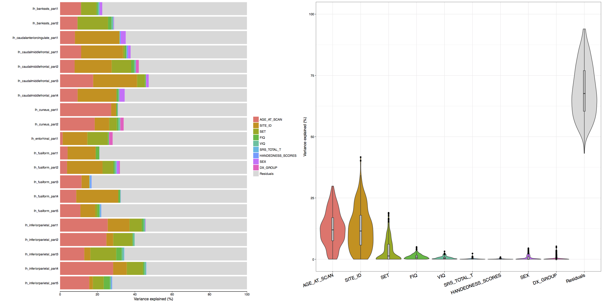
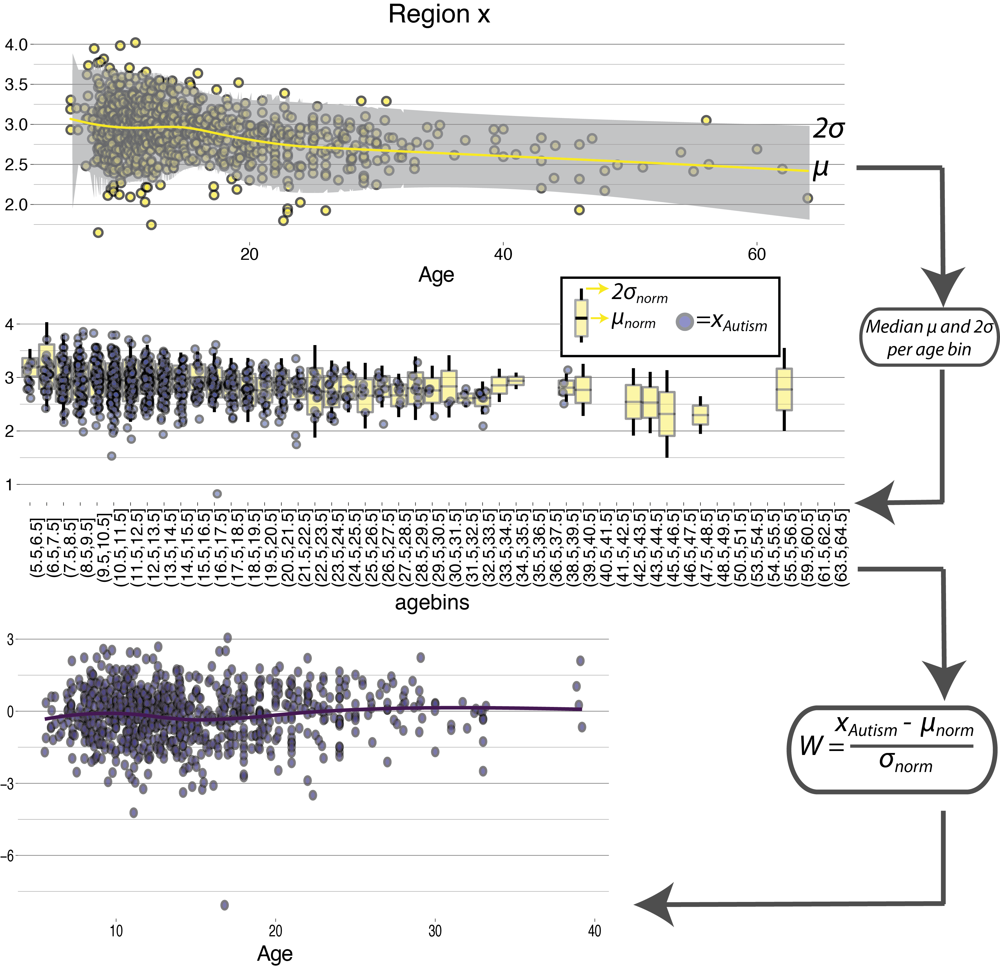
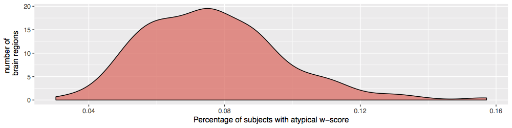

# Normative modeling in Autism - readme file
This repository accompanies the paper *"Normative age modelling of cortical thickness in autistic males"* currently under review. When using code from this repository please cite as follows:

> Richard A.I. Bethlehem, Jakob Seidlitz, Rafael Romero-Garcia, Guillaume Dumas, & Michael V. Lombardo. (2018, August 1). Normative age modelling of cortical thickness in autistic males (Version V2.1). Zenodo. http://doi.org/10.5281/zenodo.1325171

## Setup
General setup script to load all packages and install them if they are not already on your system

```{r, include=FALSE}
  #install.packages('easypackages')
  rm(list = ls()) # clear the workspace
  library(easypackages) # then we can do the rest in one go
  
  # get a list of all potentially useful packages
  list.of.packages <- c("Hmisc","ggplot2","caret","gplots","Rmisc","dplyr",
            "MatchIt","optmatch","data.table","plotrix","ggthemes",
            "viridis","coin","plyr","psytabs","RColorBrewer","boot",
            "msir","lmtest", "ggpubr","stats", "reshape2","xtable",
            "ez","apa","parallel", "jmuOutlier","Rtsne","fpc", "cluster",
            "RCurl","nlme","foreach","doParallel", "gridExtra","cowplot")

  source("https://bit.ly/2q4XQ66")
  
  # check if they are already installed and otherwise install them
  # note: this doesn't work for biocLite tools
  new.packages <- list.of.packages[!(list.of.packages %in% installed.packages()[,"Package"])]
  if(length(new.packages)>0) { install.packages(new.packages)}

  # then load them all
  libraries(list.of.packages)
  rm(list.of.packages, new.packages)
```

#### Set the working directory to whichever directory you downloaded this repository to and then load the custom functions 
```{r, include=FALSE}
  source("./Scripts/_variancePart.R")
  source("./Scripts/_computeRatios.R")
  source("./Scripts/_tsneParcellaton.R")
  source("./Scripts/1_MergingData.R")
  source("./Scripts/2_localRegression.R")
  source("./Scripts/3_Stats.R")
  source("./Scripts/4_SymptomCorrelations.R")
```

## Data merging
Merge ABIDE I and ABIDE II into one dataframe taking all overlapping columns and adding in all anatomical data. In addition, this script runs basic matching on age using the nearest neighbour matching algorithm from the match.it package (http://gking.harvard.edu/matchit). Finally it plots and writes out some descriptive statistics and creates the basic output structure that subsequent functions rely upon.
```{r, include=FALSE}
Job1 = mcparallel(mergeData(measure = "LGI", parcellation = "500aparc"))
Job2 = mcparallel(mergeData(measure = "CT", parcellation = "500aparc"))
Job3 = mcparallel(mergeData(measure = "Area", parcellation = "500aparc"))
Job4 = mcparallel(mergeData(measure = "Vol", parcellation = "500aparc"))
mccollect(list(Job1, Job2, Job3, Job4))
```

## Data inspection
This function runs variance partitioning (Hoffman & Schadt 2006: https://www.ncbi.nlm.nih.gov/pmc/articles/PMC5123296/) for the most common variables and prints the result to a PDF.
```{r, include=FALSE}
varianceStats(measure = "LGI", parcellation = "500aparc", threshold = TRUE)
varianceStats(measure = "CT", parcellation = "500aparc", threshold = TRUE)
varianceStats(measure = "Area", parcellation = "500aparc", threshold = TRUE)
varianceStats(measure = "Vol", parcellation = "500aparc", threshold = TRUE)
```


## Local regression and calculation of normative scores
This function runs LOESS regression on the normative data, bins the data by age and then uses the age-bin specific mean and standard deviation to compute a w-score for all individuals with autism. The function also contains some plotting options to plot curves for every individual brain region, but to save time these are currently commented out (printing 300+ pdfs takes quite long...).

Like this:

```{r, include=FALSE}
Job1 = mcparallel(localRegression(measure = "LGI", parcellation = "500aparc", threshold = TRUE))
Job2 = mcparallel(localRegression(measure = "CT", parcellation = "500aparc", threshold = TRUE))
Job3 = mcparallel(localRegression(measure = "Area", parcellation = "500aparc", threshold = TRUE))
Job4 = mcparallel(localRegression(measure = "Vol", parcellation = "500aparc", threshold = TRUE))
mccollect(list(Job1, Job2, Job3, Job4))
```

## Run statistics
This function: 
* runs the canonical linear mixed effects model for conventional case-control analysis
* runs the canonical linear mixed effects model for conventional case-control analysis, with w-score outliers removed
* runs the one-sample test on the w-scores with outliers removed

The resulting csv files were subsequently plotted using the whitakerlab pysurfer tools: https://github.com/WhitakerLab/BrainsForPublication
```{r, include=FALSE}
Job1 = mcparallel(basicStats(measure = "LGI", parcellation = "500aparc", threshold = TRUE))
Job2 = mcparallel(basicStats(measure = "CT", parcellation = "500aparc", threshold = TRUE))
Job3 = mcparallel(basicStats(measure = "Area", parcellation = "500aparc", threshold = TRUE))
Job4 = mcparallel(basicStats(measure = "Vol", parcellation = "500aparc", threshold = TRUE))
mccollect(list(Job1, Job2, Job3, Job4))
```

## Multi-Dimensional embedding & clustering
Barnes-Hut tSNE (Maaten, 2014) was used to construct a 2-dimensional embedding for all parcels in order to be able to run k-medoid clustering in a 2D representation. Next, we performed partitioning around medoids (PAM), estimating the optimum number of clusters using the optimum average silhouette width (Hennig and Liao, 2013).

```{r, include=FALSE}
Job1 = mcparallel(tsneParcellation(measure = "LGI", parcellation = "500aparc", threshold = TRUE))
Job2 = mcparallel(tsneParcellation(measure = "CT", parcellation = "500aparc", threshold = TRUE))
Job3 = mcparallel(tsneParcellation(measure = "Area", parcellation = "500aparc", threshold = TRUE))
Job4 = mcparallel(tsneParcellation(measure = "Vol", parcellation = "500aparc", threshold = TRUE))
mccollect(list(Job1, Job2, Job3, Job4))
```

## Symptom*W-Score correlation
This computes spearman correlation between w-scores and most common phenotypic variables
```{r, include=FALSE}
Job1 = mcparallel(symptomCorrelation(measure = "LGI", parcellation = "500aparc", threshold = TRUE))
Job2 = mcparallel(symptomCorrelation(measure = "CT", parcellation = "500aparc", threshold = TRUE))
Job3 = mcparallel(symptomCorrelation(measure = "Area", parcellation = "500aparc", threshold = TRUE))
Job4 = mcparallel(symptomCorrelation(measure = "Vol", parcellation = "500aparc", threshold = TRUE))
mccollect(list(Job1, Job2, Job3, Job4))
```

## Prevalence and ratio of w-scores
This function computes the ratio of positive and negative w-scores for each individual. As a summary measure we computed a ratio of absolute w-scores between those that were bigger and smaller than 2. Thus a ratio of >0.5 indicates that for that individual there were more regions with a w-score > 2. In addition, it computes the prevalence of statistical outliers (defined as w>2).

Like this:

```{r, include=FALSE}
Job1 = mcparallel(computeRatios(measure = "LGI", parcellation = "500aparc", threshold = TRUE))
Job2 = mcparallel(computeRatios(measure = "CT", parcellation = "500aparc", threshold = TRUE))
Job3 = mcparallel(computeRatios(measure = "Area", parcellation = "500aparc", threshold = TRUE))
Job4 = mcparallel(computeRatios(measure = "Vol", parcellation = "500aparc", threshold = TRUE))
mccollect(list(Job1, Job2, Job3, Job4))
```

# Optional other functions
1. *_normscores.R*: this is a slightly more generic function version of the *localRegression.R* script to compute the w-scores for the patient group. It returns a subject^brainregion matrix of w-scores
2. *_bootRegressPar.R*: this function just calls the *_normscores.R* function in a parallel loop to bootstrap (with replacement) the w-score computation and saves the full bootstrapped matrix (subject^region^bootstrap) as well as the standard deviation across the bootstrap dimension. Note that with 308 regions, 700+ subjects and 1000 bootstraps this matrix is well over 1.5Gb. Also, note that running this on a i9 14 dualcore machine took about 3 hours (so on a laptop it would likely take 1-2 days).

# Release notes
This code has been tested with RStudio 3.4.1 on the following OS+Systems: 
- Mac OS 10.12.6, 3.1Ghz i7 2*DualCore with 16GB RAM
- Ubuntu 16.04, 3.1Ghz i9 14*DualCore with 64GB RAM
